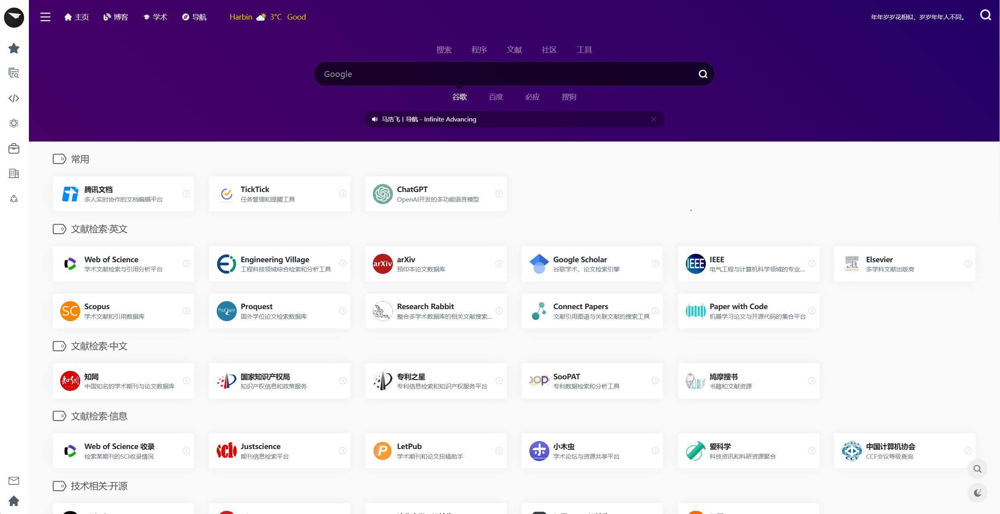

<h1 align="center">
Navigation
</h1>

## 导航

- 精简了网页代码

- 实现了自动生成页面书签功能。通过修改 `site.yaml` 内容，可以更改网页上显示的书签分类与内容，无需直接修改 HTML 源码。

- 自适应手机和电脑的导航页面，并包含了夜间模式功能。

## 效果图

## 注

特别感谢以下项目：

- [liutongxu/liutongxu.github.io](https://github.com/liutongxu/liutongxu.github.io)
- [一为忆](https://www.iowen.cn/)